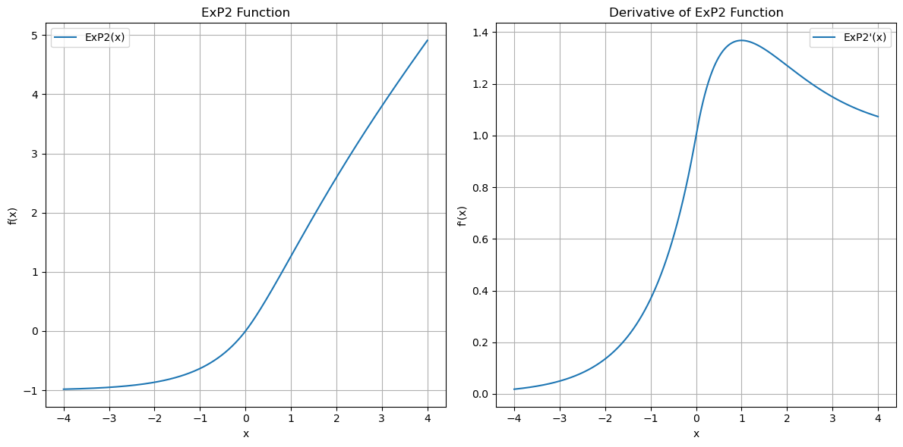

# ExP2 指数擬確率関数

### 概要
`ExP2` 指数擬確率関数（Exponential Pseudo Probability Function）は、  条件付き確率と指数関数を元にした活性化関数です。

### 関数の定義

実際のExP2関数は以下のように定義されます。

- **\( x >=0 \)の場合：**
```math
  f(x) = +(1 - e^-x) \cdot (1 + x)
```
正の入力の場合
この関数はxの符号を負に変更し、xに指数変換を行い1から引いた値に(1+x)を掛けた値を返します。  
(1+x)は勾配消失を避けるために追加しています。
  
- **\( x <  0 \)の場合：**
```math
  f(x) = -(1 - e^{x})
```

負の入力の場合、  
この関数はxの負の符号を維持し、xを指数変換し1から引いた値を返します。  

この定義により、  
この関数は負の入力で確率的な特性をもち、正の入力でペナルティ機能として振る舞います。

### 導関数

ExP2関数の導関数は以下の通りです：

- **\( x >= 0 \)の場合：**
```math
  f'(x) =  e^{-x}(x + 1) + 1 - e^{-x} 
```

- **\( x <  0 \)の場合：**
```math
  f'(x) = e^{x}
```

### PyTorchコード
```python
import torch
import torch.autograd as autograd

class ExP2(autograd.Function):
    @staticmethod
    def forward(ctx, x):
        # x>=0 (1-exp(-x))*(1+x)
        # x< 0 -(1-exp(x))
        ctx.save_for_backward(x)
        return (torch.sign(x) + torch.relu(x)) * (1 - torch.exp(-torch.abs(x)))

    @staticmethod
    def backward(ctx, grad_output):
        # x>= (x + 1)*exp(-x) + 1 - exp(-x)
        # x>=exp(x)
        x, = ctx.saved_tensors
        s  = torch.sign(x)
        pn = torch.relu(s)
        rx = torch.relu(x)
        ax = torch.abs(x)
        cp = torch.exp(-ax)
        grad_input=((rx+1)*cp+(pn-cp)*pn)*grad_output
        return grad_input
```

### 出力と微分値のプロット
以下に、`ExP2`関数の出力と微分値のプロットを示します。これにより、関数の挙動を直感的に理解することができます。

```python
import matplotlib.pyplot as plt
import torch

x = torch.linspace(-4, 4, 100, requires_grad=True)
y = ExP2.apply(x)
y.backward(torch.ones_like(x))
grad = x.grad

plt.figure(figsize=(10, 5))
plt.subplot(1, 2, 1)
plt.plot(x.detach().numpy(), y.detach().numpy(), label='ExP2 Output')
plt.title('Function Output')
plt.xlabel('x')
plt.ylabel('y')
plt.grid(True)
plt.legend()

plt.subplot(1, 2, 2)
plt.plot(x.detach().numpy(), grad.detach().numpy(), label='ExP2 Derivative')
plt.title('Function Derivative')
plt.xlabel('x')
plt.ylabel('dy/dx')
plt.grid(True)
plt.legend()

plt.show()
```
### 実際の出力と微分値


